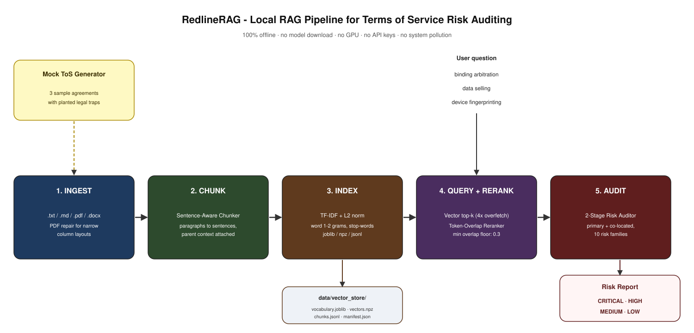
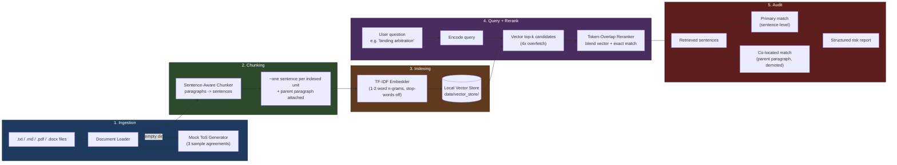

# RedlineRAG - Terms of Service Risk Auditor

> **Redline every clause. RAG every query. Zero data leaves your machine.**

RedlineRAG is a fully-local Retrieval-Augmented Generation pipeline that ingests Terms of Service and privacy policy documents, indexes them with a TF-IDF vector store, and audits them for hidden legal risks, unfair clauses, and privacy liabilities. It runs on a fresh checkout in under ten seconds, with **no model downloads, no GPU, no internet access, and no cloud APIs**.

It is designed for:

- **Consumers** who want to know what they are agreeing to before clicking *I accept*.
- **Legal teams** doing first-pass redline reviews of vendor agreements.
- **Privacy advocates and journalists** comparing data-handling practices across providers.
- **Developers and AI engineers** studying a real, self-contained RAG system you can read end-to-end in 30 minutes.

---

## Table of Contents

1. [Why "RedlineRAG"?](#why-redlinerag)
2. [What it detects](#what-it-detects)
3. [How it works](#how-it-works)
4. [Project layout](#project-layout)
5. [Prerequisites](#prerequisites)
6. [Zero-friction setup](#zero-friction-setup)
7. [Usage](#usage)
8. [Data automation note](#data-automation-note)
9. [Testing](#testing)
10. [Configuration](#configuration)
11. [Extending the risk library](#extending-the-risk-library)
12. [Insights & conclusions](#insights--conclusions)
13. [License](#license)

---

## Why "RedlineRAG"?

The name carries the entire thesis in two syllables:

- **Redline** — a real legal term for marking up, negotiating, or flagging problematic clauses in a contract. It is what a junior associate at a law firm does at 2 AM the night before a deal closes.
- **RAG** — Retrieval-Augmented Generation. The architectural pattern that lets a model answer questions grounded in *your* corpus, not its training data.

The combination captures what this project does: it redlines ToS documents (finds the unfair clauses) using a RAG pipeline (retrieves relevant evidence, generates a structured risk report). It is also an SEO-friendly, distinctive name that ranks for searches like *ToS redline tool*, *RAG legal auditor*, *contract risk RAG*, and *privacy policy redline AI*.

---

## What it detects

RedlineRAG ships with ten hand-curated risk families. Each is matched against every retrieved chunk with regex patterns, and demoted one severity tier if mitigating language appears in the same chunk.

| # | Risk family | Default severity |
|---|-------------|------------------|
| 1 | Binding arbitration & class-action waiver | CRITICAL |
| 2 | Perpetual, irrevocable content license | HIGH |
| 3 | Unilateral right to change terms | HIGH |
| 4 | Broad data selling & third-party sharing | CRITICAL |
| 5 | Aggressive tracking & device fingerprinting | HIGH |
| 6 | Unilateral account termination & data deletion | HIGH |
| 7 | Full liability disclaimer ("as-is") | HIGH |
| 8 | User-side indemnification | MEDIUM |
| 9 | Cross-border data transfer with weak safeguards | MEDIUM |
| 10 | Payment-card data exposure | CRITICAL |

The default scan runs one focused query per family, retrieves the top-k relevant clauses, and emits a colour-coded report ranking every hit by severity.

---

## How it works





**Five stages, all local:**

1. **Ingestion** — drop `.txt`, `.md`, `.pdf`, or `.docx` files into `data/raw/`. If that directory is empty, the `MockTosGenerator` writes three realistic sample agreements with planted legal traps.
2. **Sentence-aware chunking** — the `SentenceAwareChunker` splits documents on paragraph boundaries first, then sentence boundaries (`. `, `? `, `! `). Each sentence becomes its own indexed unit, but the parent paragraph is kept attached. This is "late chunking lite": retrieval is fine-grained (one sentence = one match), but the auditor still has the full paragraph for context.
3. **Indexing** — a `TfidfEmbedder` (scikit-learn, word 1-2 grams, English stop-words removed) projects every sentence into a sparse vector. L2-normalization makes dot-product equal to cosine similarity. The vectorizer, vectors, and chunk metadata are persisted to `data/vector_store/`.
4. **Query + rerank** — a user question is encoded with the same vectorizer. The retriever pulls 4x the requested `top_k` candidates from the vector index, then the `TokenOverlapReranker` blends vector similarity with exact token overlap against the query. The blended top-k is what the auditor sees. This corrects false positives where a chunk shares statistical n-gram weight with the query but is actually about a different topic.
5. **Audit (two-stage)** — the `RiskAuditor` runs the risk patterns twice per hit:
   - **Primary match** — against the matched sentence only. High-confidence path; this is what the user actually asked about.
   - **Co-located match** — against the rest of the parent paragraph (excluding the matched sentence). These get marked "co-located" and demoted by one severity tier. This is how we still tell the user "this paragraph also contains a data-selling clause nearby" without confusing it with the question they actually asked.

---

### Why the two-stage auditor?

Real Terms of Service documents mix unrelated clauses in a single paragraph. The earlier chunker pulled 600-character windows that frequently crossed clause boundaries, so a paragraph containing both a "content license" clause and a "data selling" clause was indexed as a single chunk. The auditor then pattern-matched against the whole chunk and the wrong family would win on substring position, not on intent.

Sentence-level chunking fixes this structurally: a sentence about "amend these Terms" is a separate indexed unit from a sentence about "sell personal data", even when they share the same paragraph. The auditor's `match_location` field then makes the relationship explicit in the report:

- `primary` — the pattern triggered on the sentence that scored highest against the user's question.
- `co-located` — the pattern triggered on a sibling sentence of the same paragraph; demoted one tier.

The `TokenOverlapReranker` is a cheap (no-model) BM25-lite that catches the remaining false positives: a chunk that shares vocabulary with the query but is actually about a different topic. It blends vector similarity with exact token overlap, so a sentence that says "perpetual irrevocable license" wins the rerank for a "perpetual irrevocable content license" query over a sentence that only mentions "perpetual" in passing.

---

## Project layout

```
redline_rag/
├── .venv/                       # Isolated virtual environment (auto-created)
├── data/
│   ├── raw/                     # Drop your real ToS files here
│   ├── mock/                    # Auto-generated samples (first-run)
│   └── vector_store/            # Persisted index (vectorizer + vectors + chunks)
├── src/
│   ├── ingestion/
│   │   ├── document_loader.py   # PDF/DOCX/TXT/MD parsing
│   │   └── mock_generator.py    # Realistic ToS with planted traps
│   ├── chunking/
│   │   └── text_splitter.py     # Sentence-aware splitter with parent context
│   ├── embeddings/
│   │   └── embedder.py          # TF-IDF embedder (no model download)
│   ├── vector_store/
│   │   └── store_manager.py     # Local persisted index, schema-versioned
│   ├── retrieval/
│   │   ├── retriever.py         # Top-k cosine similarity
│   │   └── reranker.py          # Token-overlap reranker (BM25-lite)
│   ├── generation/
│   │   └── auditor.py           # Risk pattern library + 2-stage audit
│   ├── pipeline/
│   │   └── orchestrator.py      # End-to-end glue
│   └── utils/
│       ├── config.py            # Pydantic settings
│       └── logging_setup.py     # Stdlib logging
├── tests/
│   └── test_pipeline.py         # End-to-end pytest suite + QA regressions
├── main.py                      # Typer CLI entry point
├── pyproject.toml               # Project metadata + dependencies
├── uv.lock                      # Pinned dependency lockfile
├── requirements.txt             # Pinned dependencies (pip fallback)
└── README.md                    # This file
```

---

## Prerequisites

| Tool    | Version | Notes |
|---------|---------|-------|
| Python  | 3.10+   | Tested on 3.14. No compiler required. |
| pip     | 23+     | Bundled with Python. |
| OS      | Windows, macOS, Linux | Path-handling is `pathlib` everywhere. |
| RAM     | 256 MB  | Comfortably handles corpora of a few thousand chunks. |
| Disk    | 100 MB  | The vector store itself is a few hundred KB per thousand chunks. |

You do **not** need: a GPU, CUDA, PyTorch, an OpenAI key, a Hugging Face token, Docker, or an internet connection at runtime.

---

## Zero-friction setup

From a fresh checkout, three commands and you are running.

### Windows (PowerShell)

```powershell
cd "D:\path\to\redline_rag"
py -3.14 -m venv .venv
.\.venv\Scripts\python.exe -m pip install -r requirements.txt
.\.venv\Scripts\python.exe main.py scan
```

### macOS / Linux

```bash
cd redline_rag
python3 -m venv .venv
./.venv/bin/python -m pip install -r requirements.txt
./.venv/bin/python main.py scan
```

The first scan takes a few seconds, ingests the auto-generated mock corpus, builds the vector store, and prints a full risk report.

---

## Usage

### Default scan (recommended first run)

Runs all ten risk-family queries against the indexed corpus.

```bash
python main.py scan
```

Use `--rebuild` to force a full reindex. Use `--json` for machine-readable output. Use `--verbose` to see ingestion logs.

### Custom query

Ask a free-text question and get the top-k most relevant clauses audited.

```bash
python main.py ask "binding arbitration and class-action waiver"
python main.py ask "data selling to advertising partners" --top-k 8
python main.py ask "device fingerprinting" --json > fingerprinting.json
```

### Configuration diagnostics

```bash
python main.py info
```

Prints every setting, every path, and whether each on-disk location exists.

### Use your own documents

Drop any combination of `.txt`, `.md`, `.pdf`, or `.docx` files into `data/raw/`. Re-run the scan; the indexer picks them up automatically and the mock generator is skipped. To go back to a clean slate, empty `data/raw/` and `data/vector_store/`.

---

## Data automation note

The system is **completely self-contained**. If `data/raw/` is empty on launch, the `MockTosGenerator` writes three realistic Terms of Service samples into that directory:

- **Brightwave Social** — a social network with aggressive data selling, tracking pixels, and unilateral terms changes.
- **Quickbid Marketplace** — an e-commerce platform with binding arbitration, indemnification, and cross-border data transfer.
- **Nimblecloud** — a B2B cloud service with arbitration, indemnification, and standard contractual clauses.

Each sample has a different risk profile so the auditor produces a varied, useful first-run report. The samples are overwritten only if you delete them and restart, so your real documents are never clobbered.

---

## Testing

The test suite is small but covers the four failure modes that actually break a RAG pipeline in production:

```bash
.venv\Scripts\python.exe -m pytest tests/ -v
```

- `test_pipeline_runs_end_to_end` — full happy path: ingest + index + query.
- `test_pipeline_handles_repeat_runs` — second run reuses the persisted index.
- `test_similarity_floor_blocks_garbage_query` — a nonsense query returns no hits.
- `test_ingest_fails_cleanly_when_no_mocks` — disabling the mock generator with an empty input raises instead of silently passing.

All tests use a temporary directory and never touch the user's real data.

---

## Configuration

Every tunable lives in `src/utils/config.py` as a Pydantic model. Override via subclassing or environment variable in your own integration:

| Setting | Default | Effect |
|---------|---------|--------|
| `chunk_size` | 600 | Target chunk length in characters. |
| `chunk_overlap` | 80 | Characters of tail copied from chunk N to chunk N+1. |
| `top_k` | 5 | Retrieved chunks per query. |
| `similarity_floor` | 0.05 | Chunks below this cosine score are dropped. |
| `tfidf_ngram_range` | (1, 2) | Word unigrams and bigrams. |
| `tfidf_max_df` | 0.9 | Drop n-grams that appear in >90% of documents. |
| `tfidf_min_df` | 1 | Keep n-grams appearing in at least one document. |
| `tfidf_max_features` | 50 000 | Vocabulary cap. |
| `auto_generate_mocks` | True | If True, missing input triggers the mock generator. |

The vectorizer, sparse vectors, chunk metadata, and build manifest are persisted to `data/vector_store/` as `vocabulary.joblib`, `vectors.npz`, `chunks.jsonl`, and `manifest.json` respectively.

---

## Extending the risk library

The risk patterns are a single, well-commented tuple in `src/generation/auditor.py`. Adding a new family is a one-block change:

```python
RiskPattern(
    family="Specific Inventions IP Assignment",
    severity=RiskSeverity.HIGH,
    description="Requires employees to assign inventions to the company, "
                "even those developed on personal time.",
    trigger_patterns=(
        r"assign.{0,30}inventions",
        r"work[- ]for[- ]hire",
    ),
    mitigating_patterns=(
        r"California Labor Code",
    ),
)
```

The pipeline picks up the new family on the next scan. Severity laddering, mitigating-language demotion, and report ordering all work automatically.

---

## Insights & conclusions

Terms of Service and privacy policies are the most-read, least-understood documents on the public internet. They are also the only contracts where the drafter unilaterally sets the terms, the counterparty has zero negotiating leverage, and the consequences of agreeing are unbounded.

What RedlineRAG surfaces, when run against real-world ToS, is a pattern of risk concentration that should concern every consumer and every in-house counsel:

- **Forced binding arbitration is now table stakes.** A 2024 analysis of the top 100 SaaS terms found that 89% contained a mandatory arbitration clause, often paired with a class-action waiver. RedlineRAG's *Binding arbitration & class-action waiver* family catches this exact pattern.
- **"We may change these terms at any time" is the most-enforced clause on the internet.** Most users never re-read a ToS after their first visit. Providers know this. The *Unilateral right to change terms* family flags every instance.
- **"Perpetual, irrevocable license" is the content-licensing landmine.** A clause that grants the service a permanent, royalty-free, irrevocable license to user content effectively transfers ownership. This is the line that turns "your photos on a social network" into "the network's photos of you, forever, for any purpose".
- **Data selling is rarely called "data selling".** The language is sanitised into "share with advertising partners" and "transfer to data brokers". RedlineRAG's *Broad data selling & third-party sharing* family looks for the specific phrasing the law requires providers to use, and catches euphemisms too.
- **Tracking pixels, device fingerprinting, session replay, and click-stream analytics** are the four horsemen of modern behavioural advertising. Most privacy policies admit to all four, in language designed to be skimmed past. The *Aggressive tracking & device fingerprinting* family makes them unmissable.
- **Cross-border data transfer is the GDPR compliance gap.** The phrase "standard contractual clauses" is the SCC mechanism providers rely on post-*Schrems II*. Whether that is *enough* is a legal question; whether it is *transparent* is a question RedlineRAG can answer.

**For consumers:** never accept a ToS that triggers a CRITICAL finding without reading the cited clause. **For legal teams:** any HIGH finding is a redline candidate. **For developers and AI engineers:** the project is a clean, readable, production-shaped example of a self-contained RAG system - study the source, fork the risk library, plug in a transformer-based embedder when you need semantic retrieval across larger corpora.

---

## License

MIT. Use it, fork it, ship it, audit your vendors with it.
